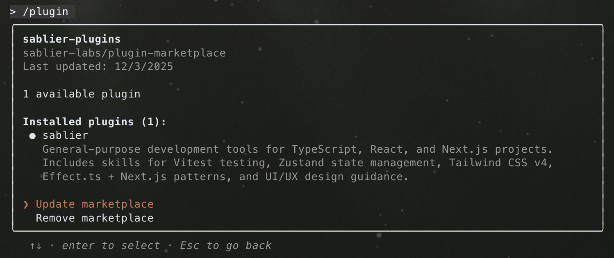

# plugin-marketplace

Official Sablier plugin marketplace for AI agents like Claude Code.

See Anthropic's [official docs](https://code.claude.com/docs/en/plugin-marketplaces) for more guidance on plugins.

## Plugins

### sablier

Sablier protocol context and design guidelines.

**Skills:**

- `sablier` — Sablier protocol overview: token vesting, airdrops, and onchain payroll
- `design` — Sablier dark-theme aesthetic and production-grade React interfaces

**Commands:**

- `/create-issue` — Create GitHub issues in sablier-labs repositories

### fp

Functional programming patterns with Effect-TS.

**Skills:**

- `effect-ts` — Effect-TS functional programming patterns
- `effect-ts-next` — Effect-TS + Next.js integration patterns

### frontend

Frontend development tools: Tailwind CSS, Zustand, UI specs.

**Skills:**

- `tailwind-css` — Tailwind CSS v4 rules and tailwind-variants
- `zustand` — Zustand state management with TypeScript

**Commands:**

- `/spec-screenshot` — Analyze screenshots and generate `SPEC.md` implementation specs

### testing

Testing frameworks and patterns for TypeScript projects.

**Skills:**

- `vitest-v4` — Vitest v4 testing patterns for TypeScript React/Next.js

### web3

Blockchain and Web3 development tools.

**Skills:**

- `coingecko-api` — CoinGecko API for token metadata and logo retrieval
- `etherscan-api` — Etherscan API V2 for blockchain balance queries
- `viem` — Viem TypeScript interface for Ethereum interactions

## Installation

> [!IMPORTANT]
>
> To be able to use the plugins, you must have [ni](https://github.com/antfu-collective/ni) installed globally.

```bash
npm i -g @antfu/ni
```

Then, run these commands in a Claude Code chat:

```
# Add this repository as a marketplace
/plugin marketplace add sablier-labs/plugin-marketplace

# Install plugins (choose the ones you need)
/plugin install sablier@sablier-plugins
/plugin install fp@sablier-plugins
/plugin install frontend@sablier-plugins
/plugin install testing@sablier-plugins
/plugin install web3@sablier-plugins
```

Restart Claude Code, then verify with `/plugin browse` to confirm skills and commands are loaded.

## Updating

There is no CLI command for updating a marketplace (i.e., no `claude plugin update` command exists). See
[anthropics/claude-code#11676](https://github.com/anthropics/claude-code/issues/11676) for tracking.

In the meantime, use the interactive `/plugin` built-in command to update:



## Contributing

See [CONTRIBUTING.md](CONTRIBUTING.md).

## License

MIT
